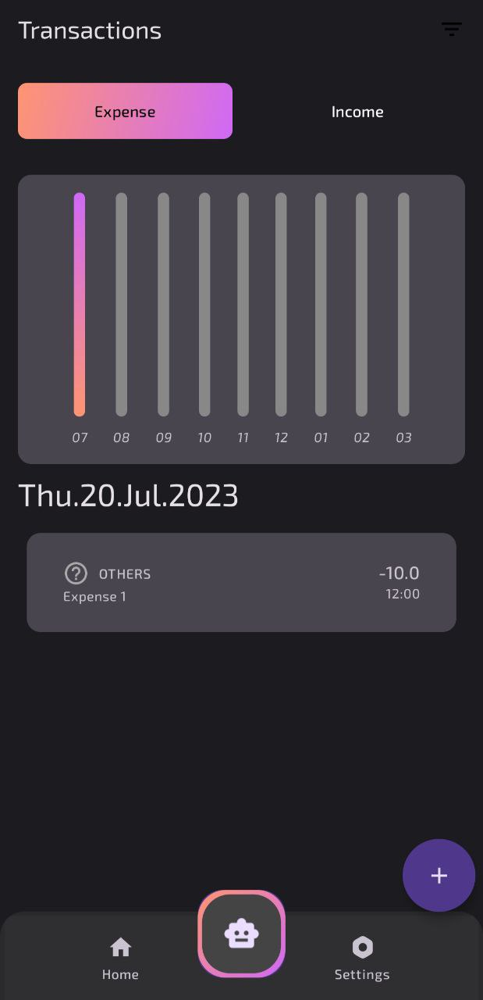
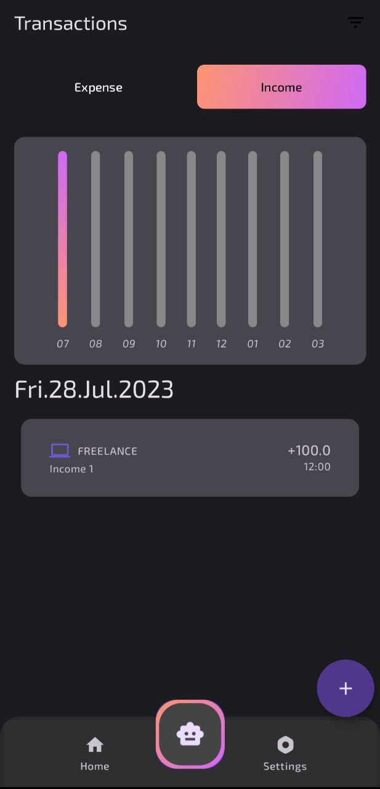

# Gxpense: Your Personal Finance Assistant

Welcome to **Gxpense**, a cutting-edge finance management application designed to empower users with real-time financial insights and personalized finance management strategies. Integrating the power of GPT-3.5 Turbo via the OpenAI API, Gxpense offers a unique blend of automation and intelligence, enabling smarter financial decisions.

## Features

- **Intelligent Finance Assistant:** Leveraging GPT-3.5 Turbo, Gxpense provides personalized financial advice, budgeting tips, and expenditure tracking insights.
- **Comprehensive Finance Management:** Easily track your expenses, manage incomes, and analyze financial data in one unified interface.
- **Secure Authentication:** With AWS Cognito, your financial data remains secure through robust authentication mechanisms.
- **Cloud-Enabled Efficiency:** Powered by AWS services such as Amplify, DynamoDB, Lambda, and API Gateway, Gxpense guarantees a seamless and scalable user experience.

## Download

- **APK File Location:** [Download APK File/Application](https://github.com/guyfloki/Gxpense/blob/main/APPLICATION/app-debug.apk)

## Screenshots

Here's a sneak peek into the Gxpense application:

### Authentication Screen

### Main Dashboard

### Intelligent Assistant

### Expenses Tracker

### Incomes Tracker

## Getting Started

To get started with Gxpense, simply download the application and follow the on-screen instructions to set up your account. Once logged in, you'll have access to all features and can start managing your finances.